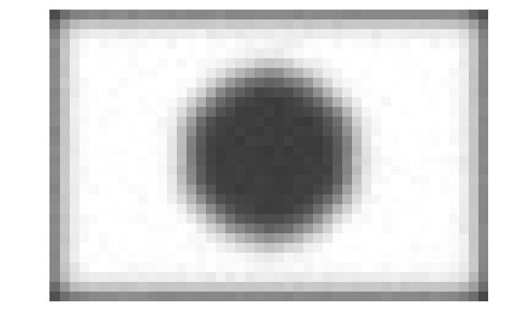
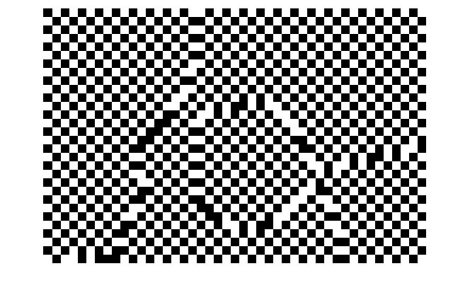

# InverseProblemsExample

[](https://github.com/arturgower/InverseProblemsExample.jl/actions/workflows/CI.yml?query=branch%3Amain)

A package to teach the basics of inverse problems, focused on regularisation, and an intro on Bayesian statistics with Gaussian distributions. The examples are in the folder [examples](examples/). Below we show the basics of Tikhonov regularisation for image deblurring based on the book [1]

## Classical approach to regularisation
Here we show how to deblurr an image using Tikhonov regularisation. See [these slides](https://docs.google.com/presentation/d/e/2PACX-1vRECEhW8E6b1kLeeaujns-jXLEa3zlaKS8qiVT0z_zGo10m-xkRpWWQYOPRqmUhxb94Y23O2cNj5Kpz/pub?start=false&loop=false&delayms=3000) for some of the background and related theory for this example.


To begin, start julia in the root folder of this package. Then we will need to several packages from Julia:
```julia
using Images
using FileIO

using Plots
using Statistics
using LinearAlgebra
```
Next we load an image of the flag of Japan, and down sample it so that the code will run quickly.
```julia
    img = FileIO.load("images/flag.png")
    gray_img = Gray.(img)
    M = Float64.(gray_img)

    i1, i2 = size(M)
    samples = 30;

    inds1 = Int.(round.(collect(LinRange(1, i1, samples))))
    inds2 = Int.(round.(collect(LinRange(1, i2, Int(round(samples * i2 / i1))))))
    
    M = M[inds1,inds2]

    plot(Gray.(M), axis = false, 
        xlab = "", ylab = "", 
        frame = :none
    ) 
```


Now let us blur this image, and add 1% Gaussian noise.
```julia
    kernel(x,y) = exp(- x^2 / (2.0)^2 - y^2 / (2.0)^2)

    img_size = size(M)

    A = zeros(img_size[1],img_size[2],img_size[1],img_size[2])

    for i in CartesianIndices(A)
        A[i] = kernel(i[1]-i[3],i[2]-i[4])
    end

    l1 =  Int(round(img_size[1]/2))
    l2 =  Int(round(img_size[2]/2))

    sumkernal = sum(kernel(x,y) for x in -l1:l1, y in -l2:l2)

    A = reshape(A,length(M),length(M)) ./ sumkernal

    ϵ = 0.01
    x = M[:]
    y = A * x + ϵ .* randn(length(M))

    Mblur = reshape(y, img_size...)

    plot(Gray.(Mblur), axis = false, 
        xlab = "", ylab = "", 
        frame = :none
    )    
```


As we know the blurring operator `A`, the temptation to deblur this image is just to solve `x_solution = A \ y`
```julia
    x_solution = A \ y
    norm(A * x_solution - y) / norm(y)

    Msol = reshape(x_solution, img_size...);

    plot(Gray.(Msol), axis = false, 
        xlab = "", ylab = "", 
        frame = :none
    )    
```


Because information is lost when deblurring, the problem of solving for `x` is ill posed. Small changes in `y` lead to large changes in `x`. To solve this we need to make some assumption about `x`. For details see [these slides](https://docs.google.com/presentation/d/e/2PACX-1vRECEhW8E6b1kLeeaujns-jXLEa3zlaKS8qiVT0z_zGo10m-xkRpWWQYOPRqmUhxb94Y23O2cNj5Kpz/pub?start=false&loop=false&delayms=3000).

Let us use Tikhonov regularisation.
```julia

# choose the regularisation parameter based on the expected noise
δ = ϵ

y_tikh = [y; zeros(size(A)[2])]
A_tikh = [A; sqrt(δ) * diagm(ones(Float64,size(A)[2]))]

x_solution = A_tikh \ y_tikh

Msol = reshape(x_solution, img_size...);

plot(Gray.(Msol), axis = false, 
    xlab = "", ylab = "", 
    frame = :none
)    
```


Which we can now compare the blurred flag:


and the original flag:


## References
[1] Kaipio, Jari, and Erkki Somersalo. Statistical and computational inverse problems. Vol. 160. Springer Science & Business Media, 2006.